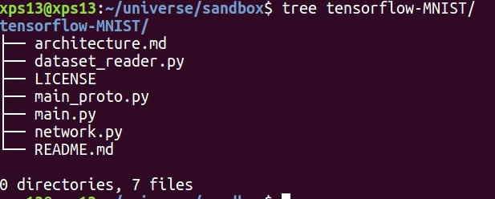

# Tensorflow-MNIST

This is a warm up project for using tensorflow to best some of the tensorflow features for heads up in Tensorflow 

# TODO
1. Create proper graph and visualization using tensorboard features
2. Save and restore session for the graph
3. Freeze particular cnn layer and train the model with partial frozen model

# Completed task
<del>1. Create working network</del>

## Create a working network details

The project has a file structure like  

The file architecture.md has the parameters calculated and gives the rough estimates of how computationally expensive the feed forward network is going to be

The script dataset_reader.py is a script which helps in reading the MINIST dataset and returns the np array for input data

The script main.py is the main script which executes training and calls sub scripts required to run the network.

The script network.py is the heart of the CNN network which has all the network layers and gets in the input and returns the output after passing it through multiple CNN layers.

